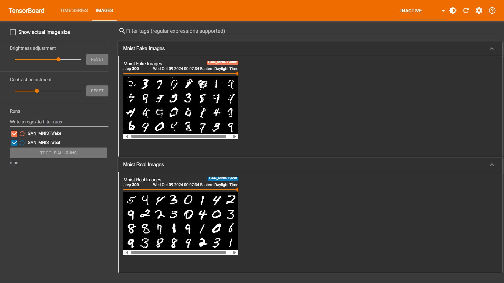

# Simple GAN Implementation: A Step-by-Step Guide

## Result at 300 epoch:

## Overview
This README provides a detailed explanation of a simple Generative Adversarial Network (GAN) implementation in PyTorch. We will go step by step through the code, highlighting the key concepts, dimensions, and processes involved in training the GAN. The code consists of two main components: the **Generator** and the **Discriminator**. Throughout this guide, we will also address some crucial questions about the architecture and explain the rationale behind important decisions made during training.

## GAN Architecture
A simple GAN is composed of two neural networks:
1. **Generator (G)**: Takes in random noise and generates fake images.
2. **Discriminator (D)**: Takes real or fake images and outputs a confidence score representing the probability of the input being real.

### Generator (`simple_gan.py`)
- The **Generator** is a fully connected neural network that transforms a random **latent vector** (noise) into an image.
- **Input**: The latent vector has a dimension of **64**. The batch size is **32**, so the input noise has dimensions **[32, 64]**.
- **Output**: The Generator outputs images of size **784** (flattened version of **28x28**). Thus, the output dimension is **[32, 784]**.

#### Activation Functions in the Generator
- **Hidden Layers**: Uses **LeakyReLU** activation to ensure good gradient flow and to avoid dead neurons.
- **Output Layer**: Uses **Tanh** activation, which outputs values between **-1 and 1**. The reason for using **Tanh** instead of **Sigmoid** is:
  - **Tanh** allows the output to match the range of the **normalized real images** (which are also normalized to **[-1, 1]**).
  - It provides better gradient flow compared to **Sigmoid**, avoiding vanishing gradient issues.
  - **Symmetry around zero** in Tanh helps the Generator output realistic images.

### Discriminator (`simple_gan.py`)
- The **Discriminator** is a fully connected neural network that takes an input image (flattened to **784** dimensions) and outputs a confidence score.
- **Input**: Images (either real or fake) of size **784**. The input batch has dimensions **[32, 784]**.
- **Output**: A confidence score between **0 and 1** for each image, indicating the probability of the image being real. Thus, the output dimension is **[32, 1]**.

#### Activation Functions in the Discriminator
- **Hidden Layers**: Uses **LeakyReLU** to prevent the "dying ReLU" problem, which can hinder learning.
- **Output Layer**: Uses **Sigmoid** activation to output a probability value in the range **[0, 1]**.

## Training Loop (`SimpleGAN.ipynb`)
The training process involves iteratively updating the **Discriminator** and the **Generator** so that the Generator improves at creating realistic images, and the Discriminator gets better at distinguishing between real and fake images.

### Step-by-Step Explanation
1. **Flatten Real Images**
   - The **real images** from the MNIST dataset are initially of size **[32, 1, 28, 28]**. These are flattened to **[32, 784]** to match the input requirements of the fully connected networks.

2. **Generator Step**
   - **Generate Random Noise**: Random noise is generated with a shape of **[32, 64]** (batch size 32, latent vector of size 64).
   - **Generate Fake Images**: The **Generator** takes this noise and outputs a batch of **fake images** with dimensions **[32, 784]**. These generated images are also in the range **[-1, 1]**, thanks to the **Tanh** activation.

3. **Discriminator Step**
   - **Real Images**: The **real images** (flattened) of shape **[32, 784]** are passed to the **Discriminator**, which outputs a **confidence score** of shape **[32, 1]**.
   - **Loss for Real Images**: The **Discriminator**'s loss for real images is computed using **Binary Cross-Entropy (BCE) Loss** with **target labels as ones**. This encourages the Discriminator to classify real images with high confidence.
   - **Fake Images**: The **fake images** generated by the **Generator** are also passed to the **Discriminator**, which again outputs confidence scores of shape **[32, 1]**.
   - **Loss for Fake Images**: The loss for fake images is calculated using **BCE Loss** with **target labels as zeros**. This encourages the Discriminator to classify fake images with low confidence.
   - **Average Loss**: The **real loss** and **fake loss** are **averaged** to ensure the Discriminator learns to distinguish real and fake images equally well.

   #### Important Note:
   - The **Discriminator** uses **Sigmoid** as the output activation, so its confidence scores are always between **0 and 1**. Even though the **Generator** outputs images in the range **[-1, 1]**, this does not affect the **Discriminator**, since it processes both **real and fake images** consistently after normalization.

4. **Updating the Discriminator**
   - After calculating the loss for both real and fake images, we **backpropagate** and update the **Discriminator's weights** using the **optimizer** to minimize the loss.

5. **Generator Step**
   - **Generate Fake Images**: Again, random noise of shape **[32, 64]** is generated, and the **Generator** produces fake images of shape **[32, 784]**.
   - **Discriminator's Feedback**: These fake images are passed to the **Discriminator**, and the **confidence scores** are obtained.
   - **Generator Loss**: The **Generator**'s loss is calculated to maximize the **Discriminator's output** for the fake images. This is done using **BCE Loss** with **target labels as ones** because the **Generator** wants the **Discriminator** to classify the fake images as real.
   - **Updating the Generator**: The **Generator's weights** are updated using **backpropagation** to make it better at fooling the **Discriminator**.

### Flattened Images Restoration
- The images generated by the **Generator** are initially in **flattened form** of size **[32, 784]**.
- To visualize or process the generated images, they are **reshaped** back to **[32, 1, 28, 28]** using `view` or `reshape`. This step is crucial for interpreting the generated outputs as actual images.

## Key Concepts and Highlights
- **Latent Vector Size (z_dimension = 64)**: The **Generator** starts with a random latent vector of size 64 and learns to transform this into a meaningful image representation.
- **Tanh Activation in Generator**: Used to match the output range with the **normalized real images**. It helps maintain symmetry around zero, allowing better training dynamics compared to **Sigmoid**.
- **Sigmoid Activation in Discriminator**: Outputs values between **0 and 1**, representing the probability that an input image is real.
- **Loss Averaging in Discriminator**: The **real and fake losses** are averaged to maintain balance in learning to classify real and fake images.
- **Normalization**: Both **real and fake images** are normalized to **[-1, 1]**, ensuring consistency when training the **Discriminator**.

## Improvements Suggested
- **Batch Normalization**: Using **BatchNorm** layers in both the **Generator** and **Discriminator** can help stabilize training.
- **Change of Architecture**: Switching to a **DCGAN** (Deep Convolutional GAN) can yield better quality images, as convolutional networks are better suited for image generation compared to fully connected networks.

## Conclusion
This simple GAN implementation demonstrates the fundamental concepts of adversarial learning. The **Generator** and **Discriminator** learn through a continuous back-and-forth process, with the **Generator** attempting to fool the **Discriminator**, and the **Discriminator** striving to tell real images from fake ones. This README aims to walk you through each part of the process, addressing key questions and highlighting important points that may have initially been confusing.

Feel free to experiment with different hyperparameters, architectures, and techniques to see how the performance of your GAN improves. Happy coding!

